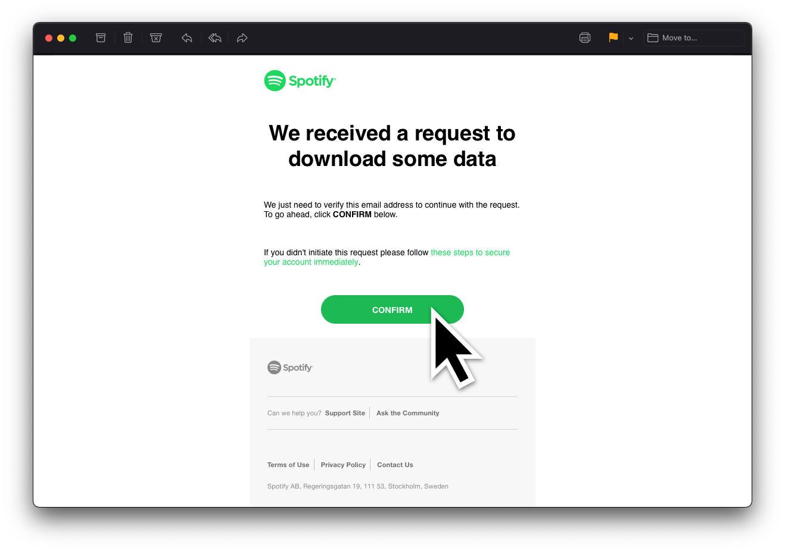
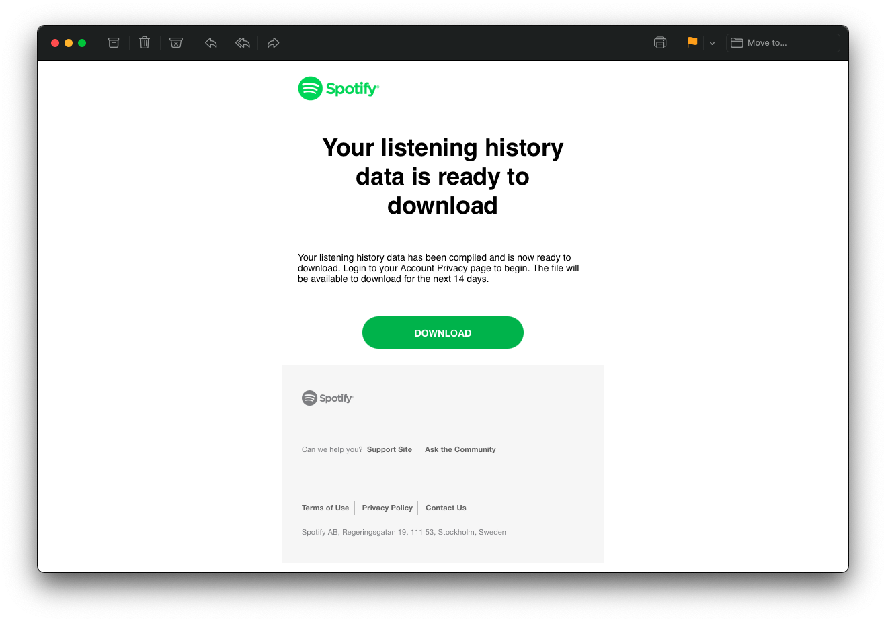
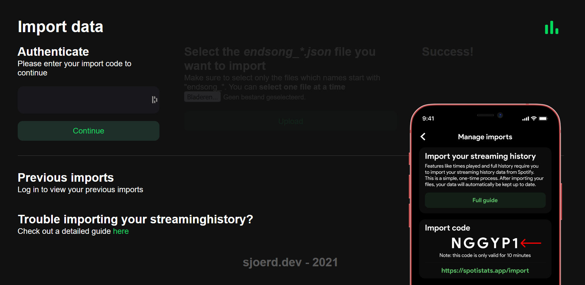
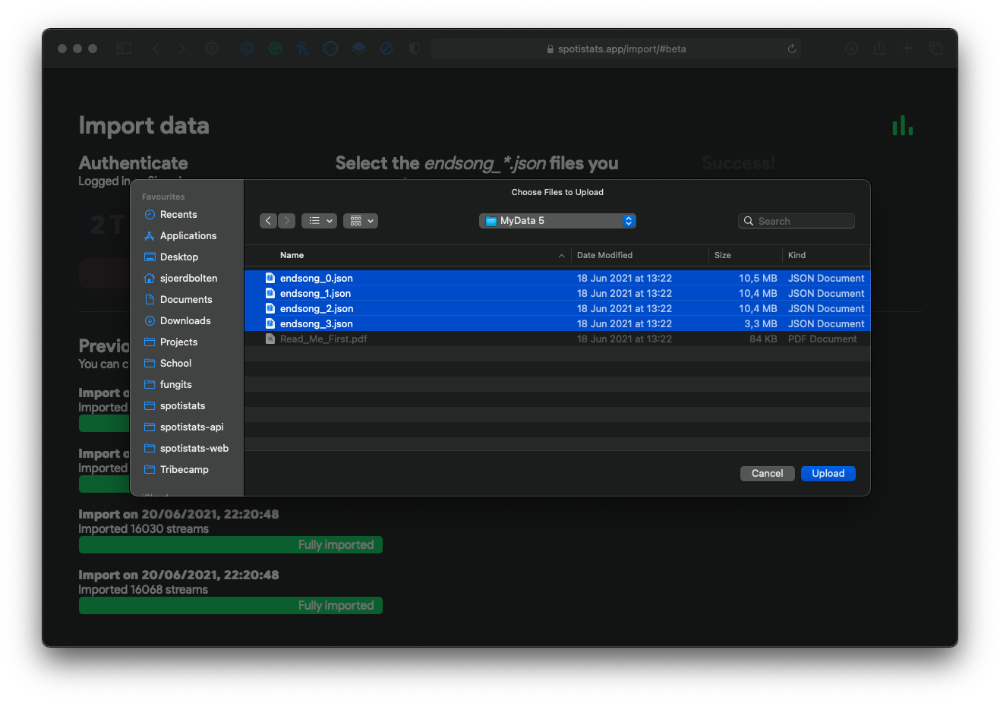
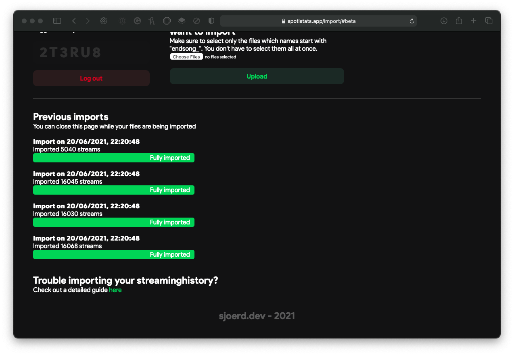

# Import Guide

## 1. Request your data from Spotify

In order to request the `endsong.json` files you need to import your streaming history, you'll need to send a simple email to `privacy@spotify.com`. You can use the template below if you like.

> Hi,
>
> I would like to receive a copy of my extended lifetime streaming history in technical endsong.json format. The data requested from the privacy tab on the spotify.com/account page only includes the data of last year, and I want my lifetime data (so the endsong.json files). A link to my Spotify profile is `link to your Spotify profile` and my username is `your username`. A song I've recently added to my library is "`name of a song youve recently added to your library`" by `name of the artist`.
> And just to be sure: I don't want the data I can request myself with the button on my account page, I'm looking for the "endsong.json" files.
>
> Best regards,   `your name`

:::tip

**Sending this email from your Spotify account's email address**, makes this process a lot easier and quicker. Otherwise they may ask for another way to identify yourself (naming a song you've recently added to your library may suffice already).

:::

## 2. Confirm your request

As soon as your request is accepted by Spotify, you'll receive a link to confirm the request in your email. Confirm it, and Spotify will start gathering your data.

## 3. Turn on _Sync streaming history_ to prevent a gap in your data

The files you receive from Spotify miss the last 2-5 days of data. For example: if you've requested the data on June 1st and you've received the data on June 14th, the data will include streams until about June 12th. You can turn on the setting _Sync streaming history_ after you've requested your files to make sure you don't miss any data. You can do so in _Settings_ > _Manage imports_ > _Sync streaming history_. Make sure to set this to _Enabled_. You can read more about streaming history synchronisation [here](../streams/sync).

## 4. Wait until you receive your data

This can take a while. As Spotify states:

> We're currently gathering a copy of your personal data. This shouldn't take longer than 30 days. But don't worry, we'll send you an email when it's ready.

It turns out, users generally receive the data within a week. That's still quite a long wait, but trust me: it's worth it :)

## 5. Download and extract the files

Once your data is ready to download, you'll get an email with a link to download a .ZIP file. You need to extract this file before proceeding. You can learn how to extract .ZIP files [here](https://www.youtube.com/watch?v=do3u3tXAbWQ).

:::warning

**Never share your files with others!** The data may contain a lot of personal information, depending on what Spotify has sent you.

:::

## 6. Get your import code

To link your files to your account, you'll need to fill in a temporary import code. You can find your unique import code in the Spotistats app on the _Manage imports_ page, found in _Settings_. Then copy and paste or type the code into the [import website](https://spotistats.app/import/).

## 7. Upload your files

When you have your extracted .JSON files ready, click the _Choose files_ button. Then, select the `endsong.json` files. You can hold shift and select files to upload multiple at a time, but you can also upload them one by one.

After clicking _Upload_, your files will be sent to the Spotistats servers.

## 8. Wait for your streams to be processed

Once your streams have reached the Spotistats servers, they need to be processed. Duplicate streams will be filtered out, and there will be a lot of calculations made for each stream in order to save it securely in the database. This can take a while. Depending on the amount of streams and the amount of people importing their streams at once this can take just a few seconds up to a couple of hours.

:::tip

If you don't like staring at a webpage for a long time, you can close the tab while your streams are being processed.

:::

## 9. Ready to go!

Congratulations! You can now view your full listening history, play count, and much more. Your future streams will be synced to the database automatically.
